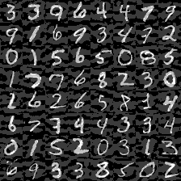
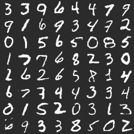
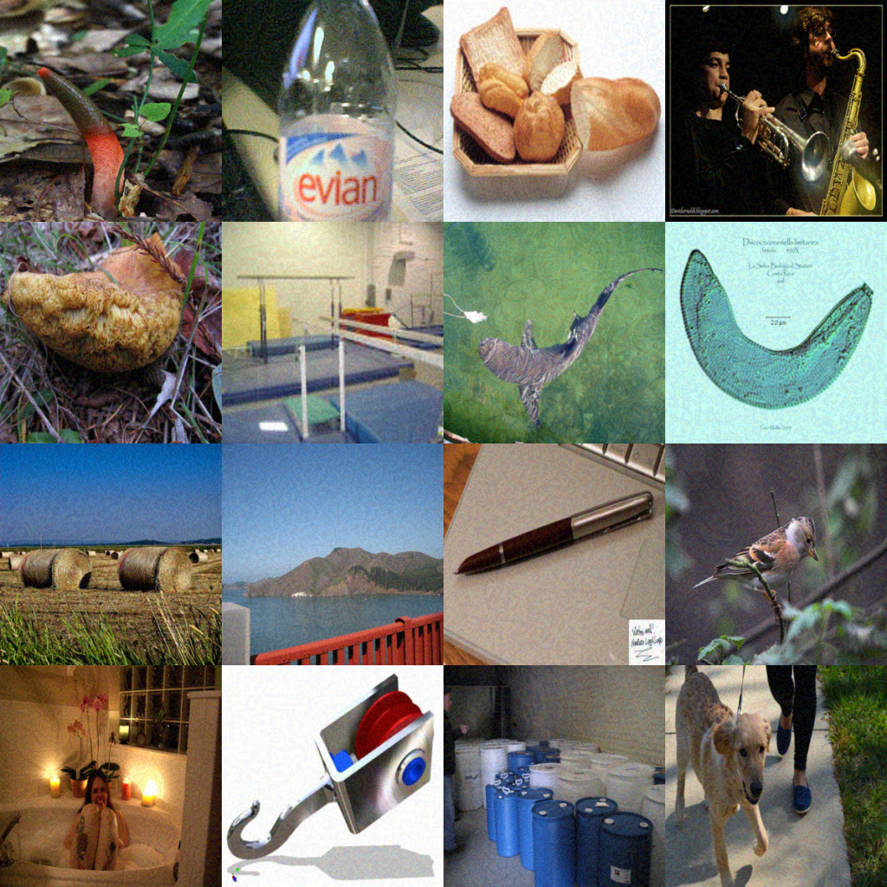
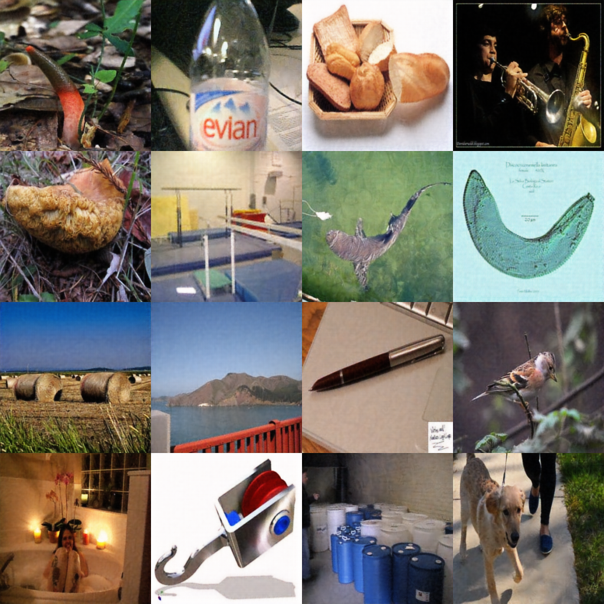

# APE-GAN in Tensorflow

Tensorflow implementation of [APE-GAN: Adversarial Perturbation Elimination with GAN
](https://arxiv.org/pdf/1707.05474.pdf).

## Prerequisites

- Python 2.7 or Python 3.3+
- [Tensorflow 0.12.1](https://github.com/tensorflow/tensorflow/tree/r0.12)
- [SciPy](http://www.scipy.org/install.html)
- [pillow](https://github.com/python-pillow/Pillow)

## Usage

To train a model with mnist:

    $ python main.py --dataset mnist --train
    $ python main.py --dataset mnist --train --adversarial_path=./data/advData.npy --ground_truth_path=./data/gtData.npy
    
To test with an existing model:

    $ python main.py --dataset mnist
    $ python main.py --dataset mnist --test_path=./data/testData.npy --save_path=./data/resAPE-GAN.npy

Or, you can use your own data by change the path of numpy. If you use the cifar10 and imageNet datasets, the input_height and output_height should be altered.

For example:

To train a model with cifar10:
    
    $ python main.py --epoch=5 --dataset=cifar10 --input_height=32 --output_height=32 --train=True --adversarial_path=./data/cifarAdv.npy --ground_truth_path=./data/cifarGt.npy

To test with an existing model on the cifar10:

    $ python main.py --dataset=cifar10 --input_height=32 --output_height=32 --test_path=advCifar-samples.npy  --save_path=resAPE-GAN_cifar.npy 

It is noteworthy that the adversarial samples cannot be
saved in the form of picture, since discretizing the values
from a real-numbered value to one of the 256 points seriously
degrades the quality. Then it should be saved and
loaded as float32 when training and test. In addition, for each pixel, 
the value should be in the range of [-1,1].

## Results
### Mnist
Adversarial example:

Reconstructed example by APE-GAN:

### ImageNet

Adversarial example:

Reconstructed example by APE-GAN:

## Related works

- [DCGAN-tensorflow](https://github.com/carpedm20/DCGAN-tensorflow)

## Author

Shiwei Shen
